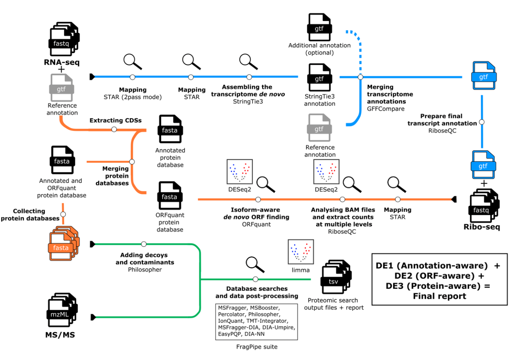

# nfdata-omics/r2t2p

[](https://github.com/nfdata-omics/r2t2p/actions/workflows/nf-test.yml)
[](https://github.com/nfdata-omics/r2t2p/actions/workflows/linting.yml)[](https://doi.org/10.5281/zenodo.XXXXXXX)
[](https://www.nf-test.com)

[](https://www.nextflow.io/)
[](https://github.com/nf-core/tools/releases/tag/4.0.2)
[](https://docs.conda.io/en/latest/)
[](https://www.docker.com/)
[](https://sylabs.io/docs/)
[](https://cloud.seqera.io/launch?pipeline=https://github.com/nfdata-omics/r2t2p)

## Introduction

**nfdata-omics/r2t2p** is a bioinformatics pipeline for integrated transcriptome, translatome, and proteome
characterization. It uses RNA-seq data to reconstruct and refine transcript annotations, Ribo-seq data to
identify translated regions at isoform level with ORFquant, and optional LC-MS/MS proteomics data to search
custom protein databases with FragPipe.

The pipeline is organized into three main analysis modules: an RNA module for de novo transcriptome assembly
and annotation merging, a Translation module for final RNA-seq/Ribo-seq alignment, RiboseQC processing,
differential analyses, and ORF discovery, and a Protein module for proteomic searches against annotated,
ORFquant-derived, and combined protein databases. Quality-control files, mapping statistics, annotation
comparison metrics, ORF summaries, proteomics logs, software versions, and workflow provenance are collected
into final reports.



The default workflow performs the following steps:

1. Read validation, concatenation of repeated runs, and raw-read QC
   ([`fq`](https://github.com/stjude-rust-labs/fq),
   [`FastQC`](https://www.bioinformatics.babraham.ac.uk/projects/fastqc/)).
2. Reference preparation, including STAR genome index generation and RiboseQC annotation preparation when needed.
3. RNA-seq genome alignment and splice-junction discovery ([`STAR`](https://github.com/alexdobin/STAR)).
4. RNA-seq-guided transcriptome assembly ([`StringTie`](https://ccb.jhu.edu/software/stringtie/)).
5. Annotation comparison and merging
   ([`GFFCompare`](https://ccb.jhu.edu/software/stringtie/gffcompare.shtml), custom R scripts).
6. Final RNA-seq and Ribo-seq alignments against the augmented annotation
   ([`STAR`](https://github.com/alexdobin/STAR)).
7. Alignment processing, feature quantification, and genome-browser coverage generation
   ([`samtools`](http://www.htslib.org/), [`RiboseQC`](https://github.com/ohlerlab/RiboseQC),
   [`bedGraphToBigWig`](https://genome.ucsc.edu/goldenPath/help/bigWig.html)).
8. Gene-level and ORF-level differential analyses when contrasts are provided
   ([`DESeq2`](https://bioconductor.org/packages/release/bioc/html/DESeq2.html),
   [`DEXSeq`](https://bioconductor.org/packages/release/bioc/html/DEXSeq.html)).
9. Isoform-aware ORF discovery and protein FASTA generation ([`ORFquant`](https://github.com/ohlerlab/ORFquant)).
10. Optional proteomic database preparation and FragPipe searches
    ([`Philosopher`](https://philosopher.nesvilab.org/), [`FragPipe`](https://fragpipe.nesvilab.org/)).
11. Aggregated QC and run-provenance reporting ([`MultiQC`](http://multiqc.info/)).

## Usage

> [!NOTE]
> If you are new to Nextflow and nf-core, please refer to [this page](https://nf-co.re/docs/get_started/environment_setup/overview) on how to set-up Nextflow. Make sure to [test your setup](https://nf-co.re/docs/get_started/run-your-first-pipeline) with `-profile test` before running the workflow on actual data.

First, prepare a samplesheet with your RNA-seq and Ribo-seq input data:

`samplesheet.csv`:

```csv
sample,fastq_1,fastq_2,library_type,condition
CONTROL_RNA_REP1,/path/to/control_rna_R1.fastq.gz,/path/to/control_rna_R2.fastq.gz,RNA,control
CONTROL_RIBO_REP1,/path/to/control_ribo.fastq.gz,,Ribo,control
TREATED_RNA_REP1,/path/to/treated_rna_R1.fastq.gz,/path/to/treated_rna_R2.fastq.gz,RNA,treated
TREATED_RIBO_REP1,/path/to/treated_ribo.fastq.gz,,Ribo,treated
```

Each row represents a single-end or paired-end RNA-seq or Ribo-seq library. The `library_type` column is used
to route reads through RNA-seq-specific and Ribo-seq-specific steps, and `condition` is used to define
contrasts when differential analyses are requested. Multiple rows with the same sample identifier are treated
as repeated sequencing runs and are concatenated before downstream analysis.

Now, you can run the pipeline using:

```bash
nextflow run nfdata-omics/r2t2p \
   -profile <docker/singularity/.../institute> \
   --input samplesheet.csv \
   --fasta <GENOME_FASTA> \
   --gtf <REFERENCE_GTF> \
   --control_label control \
   --outdir <OUTDIR>
```

You can provide `--gff` instead of `--gtf`; the pipeline will convert it to GTF format before downstream
analysis.

Proteomics searches are optional. To enable the Protein module, provide the FragPipe manifest, FragPipe workflow
file, any required TMT annotation file, and local paths to the external FragPipe tools that cannot be bundled in
the container.

For more information about the workflow rationale and expected outputs, see the pipeline documentation:

- [Workflow rationale](docs/workflow.md)
- [Usage](docs/usage.md)
- [Output](docs/output.md)

> [!WARNING]
> Please provide pipeline parameters via the CLI or Nextflow `-params-file` option. Custom config files including those provided by the `-c` Nextflow option can be used to provide any configuration _**except for parameters**_; see [docs](https://nf-co.re/docs/running/run-pipelines#using-parameter-files).

## Credits

nfdata-omics/r2t2p was originally written by R. Albanese (Calviello Group) and M. Bonfanti (National Facility for Data Handling and Analysis) at Human Technopole.

We thank the following people for their extensive assistance in the development of this pipeline:

<!-- TODO nf-core: If applicable, make list of people who have also contributed -->

## Contributions and Support

If you would like to contribute to this pipeline, please see the [contributing guidelines](docs/CONTRIBUTING.md).

## Citations

<!-- TODO nf-core: Add citation for pipeline after first release. Uncomment lines below and update Zenodo doi and badge at the top of this file. -->
<!-- If you use nfdata-omics/r2t2p for your analysis, please cite it using the following doi: [10.5281/zenodo.XXXXXX](https://doi.org/10.5281/zenodo.XXXXXX) -->

An extensive list of references for the tools used by the pipeline can be found in the [`CITATIONS.md`](CITATIONS.md) file.

This pipeline uses code and infrastructure developed and maintained by the [nf-core](https://nf-co.re) community, reused here under the [MIT license](https://github.com/nf-core/tools/blob/main/LICENSE).

> **The nf-core framework for community-curated bioinformatics pipelines.**
>
> Philip Ewels, Alexander Peltzer, Sven Fillinger, Harshil Patel, Johannes Alneberg, Andreas Wilm, Maxime Ulysse Garcia, Paolo Di Tommaso & Sven Nahnsen.
>
> _Nat Biotechnol._ 2020 Feb 13. doi: [10.1038/s41587-020-0439-x](https://dx.doi.org/10.1038/s41587-020-0439-x).
